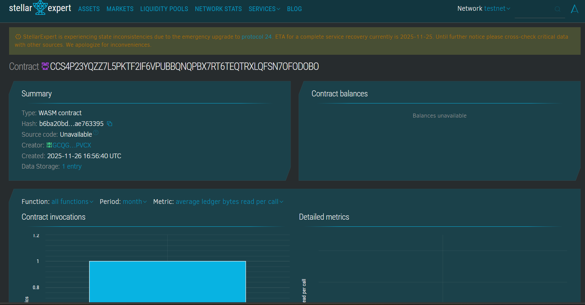

# SkillEndorse Badge

## Project Title
SkillEndorse Badge

## Project Description
SkillEndorse Badge is a blockchain-based platform that enables verified endorsements of skills by colleagues, clients, and peers. Developed on Soroban smart contracts on the Stellar blockchain, it offers transparent and immutable recording of skill endorsements enhancing credibility and professional reputation.

## Project Vision
The project aims to bring trust and verifiability to skill endorsements, reducing resume fraud and improving talent selection processes. By storing endorsements securely on blockchain, SkillEndorse Badge empowers professionals to showcase authenticated skills with trusted references.

## Key Features
- Endorsement Submission: Secure peer endorsements of skills with comments.
- Verification Mechanisms: Ensures endorsements are validated and authentic.
- Immutable Audit Trail: Endorsements permanently stored on blockchain.
- Timestamped Records: Each endorsement is timestamped for transparency.
- Public Accessibility: Endorsements viewable to empower professional networks.
- Access Control: Only authorized endorsers can submit.
- Scalable System: Supports endorsements for diverse skills and users.

## Usage Instructions
1. Submit skill endorsements with skill name and comments.
2. Verify endorsements individually to confirm authenticity.
3. Retrieve endorsement details anytime for professional validation.

## Future Scope
- Multi-factor verification including linked employment records.
- Integration with professional networking sites and HR systems.
- Aggregate endorsement scores and badges.
- User-friendly apps for managing endorsements.
- Privacy options for limiting public visibility.
- Smart contracts managing endorsement disputes.

## Technology Stack
- Soroban Rust SDK ensuring contract security and performance.
- Stellar blockchain providing decentralized ledger immutability.
- Cryptographic authentication to uphold data integrity.

## Contribution
Open for blockchain developers, talent managers, and HR consultants to innovate and secure endorsement verification. Contributions encouraged via forks and pull requests.

## License
This project is licensed under the MIT License.

### Contract Detail
ID : CCS4P23YQZZ7L5PKTF2IF6VPUBBQNQPBX7RT6TEQTRXLQFSN7OFODOBO
